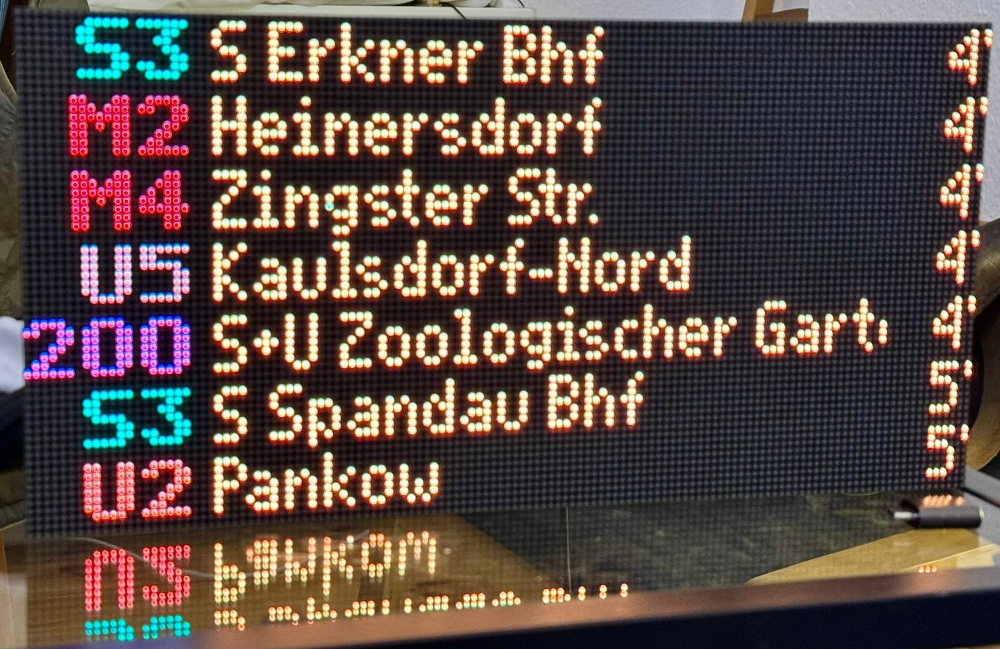

# BVG Departure Display

A real-time Berlin public transport (BVG) departure display built with a Raspberry Pi Pico W and HUB75 LED matrix panel. Shows upcoming departures with line numbers, destinations, and minutes until arrival in the distinctive BVG style.



## Features

- Real-time departure information from the [BVG REST API](https://v6.bvg.transport.rest)
- Colored display with authentic U-Bahn line colors
- Web-based configuration interface
- Access Point mode for initial WiFi setup
- Configurable station, transport types, and display options
- Filter specific lines from the display
- Walk delay to hide departures you can't catch

## Hardware Requirements

### Microcontroller (one of the following)

- **Raspberry Pi Pico W** (RP2040 + WiFi)
- **Raspberry Pi Pico 2 W** (RP2350 + WiFi)
- **Pimoroni Interstate 75 W** (recommended - includes HUB75 driver)
- Other RP2040/RP2350 boards with WiFi capability

### Display

- HUB75 LED matrix panel (supported sizes):
  - 128x32 (default)
  - 128x64
  - Other sizes supported by Interstate 75 with 32 or 64 pixel height

### Recommended Setup

The [Pimoroni Interstate 75 W](https://shop.pimoroni.com/products/interstate-75-w) is the easiest option as it combines the Pico W with a HUB75 driver board.

## Firmware

This project requires **Pimoroni MicroPython** (not standard MicroPython) as it uses the `hub75` and `picographics` libraries.

### Download Firmware

| Board | Firmware | Download |
|-------|----------|----------|
| Pico W / Interstate 75 W | Pimoroni MicroPython v1.25.0+ | [pimoroni-pico releases](https://github.com/pimoroni/pimoroni-pico/releases/latest) |
| Pico 2 W / Pico Plus 2 W | Pimoroni MicroPython v1.26.1+ | [pimoroni-pico-rp2350 releases](https://github.com/pimoroni/pimoroni-pico-rp2350/releases/latest) |

### Flashing Firmware

1. Download the appropriate `.uf2` file:
   - For **Pico W**: `picow-v1.x.x-pimoroni-micropython.uf2`
   - For **Pico 2 W**: `pico2_w-v1.x.x-pimoroni-micropython.uf2`
2. Hold the **BOOTSEL** button and connect USB (or tap **RESET** while holding BOOTSEL)
3. A drive called `RPI-RP2` will appear
4. Copy the `.uf2` file to the drive
5. The board will automatically restart

## Installation

1. Flash the Pimoroni MicroPython firmware (see above)

2. Copy the following files to the Pico:
   ```
   main.py
   web_server.py
   settings.py
   hw_conf.py
   font_bvg.py
   ansiwen128x64.png
   lib/aiohttp/          (directory)
   ```

3. Use a tool like [Thonny](https://thonny.org/), [mpremote](https://docs.micropython.org/en/latest/reference/mpremote.html), or [rshell](https://github.com/dhylands/rshell) to copy files.

   Example with mpremote:
   ```bash
   mpremote cp main.py :
   mpremote cp web_server.py :
   mpremote cp settings.py :
   mpremote cp hw_conf.py :
   mpremote cp font_bvg.py :
   mpremote cp ansiwen128x64.png :
   mpremote cp -r lib :
   ```

## Configuration

### Initial Setup (Access Point Mode)

On first boot (or if WiFi credentials are not configured):

1. The display shows "WiFi Setup Mode"
2. Connect to the WiFi network **BVGdisplay** (open network)
3. Open `http://192.168.4.1` in your browser
4. Enter your WiFi credentials and select a station
5. Click **Save Settings** and then **Restart Device**

### Web Interface

Once connected to your WiFi, access the configuration page at `http://<device-ip>/`

Settings available:
- **WiFi SSID / Password** - Your WiFi network credentials
- **API URL** - BVG REST API endpoint (default: `https://v6.bvg.transport.rest`)
- **Station Search** - Search and select your departure station
- **Filtered Lines** - Hide specific lines (e.g., U5, S8)
- **Walk Delay** - Time in seconds to walk to the station (hides departures you can't catch)
- **Destination Offset** - Pixel offset for destination text alignment
- **Transport Types** - Enable/disable Bus, Tram, U-Bahn, S-Bahn, Regional, Express, Ferry
- **Colored Display** - Show transport type colors
- **Subway Line Colors** - Use authentic U-Bahn line colors (U1=green, U2=orange, etc.)

### Hardware Configuration

Edit `hw_conf.py` to match your display:

```python
from hub75 import COLOR_ORDER_RGB, COLOR_ORDER_RBG
from picographics import DISPLAY_INTERSTATE75_128X32, DISPLAY_INTERSTATE75_128X64

# Select your display size
DISPLAY = DISPLAY_INTERSTATE75_128X32
# DISPLAY = DISPLAY_INTERSTATE75_128X64

# Adjust if colors appear wrong (RGB vs RBG panels)
COLOR_ORDER = COLOR_ORDER_RGB
# COLOR_ORDER = COLOR_ORDER_RBG
```

Available display options:
- `DISPLAY_INTERSTATE75_128X32`
- `DISPLAY_INTERSTATE75_128X64`
- `DISPLAY_INTERSTATE75_192X64`
- `DISPLAY_INTERSTATE75_256X64`

## Settings File

Settings are stored in `/settings.json` on the device. Default values:

```json
{
  "WIFI_SSID": "",
  "WIFI_PASSWORD": "",
  "API_URL": "https://v6.bvg.transport.rest",
  "STATION_ID": 900100003,
  "FILTERED": [],
  "WALK_DELAY": 0,
  "DEST_OFFSET": 23,
  "COLORED": true,
  "SUBWAY_COLORS": true,
  "SHOW_BUS": true,
  "SHOW_TRAM": true,
  "SHOW_SUBWAY": true,
  "SHOW_REGIONAL": true,
  "SHOW_SUBURBAN": true,
  "SHOW_FERRY": true,
  "SHOW_EXPRESS": true
}
```

## Troubleshooting

### Display shows "No WiFi configured"
The device couldn't find WiFi credentials. Connect to the **BVGdisplay** WiFi network and configure via the web interface.

### Display shows "Starting AP mode..." after connection failure
WiFi connection failed after multiple attempts. Check your SSID and password in the web interface.

### Colors appear wrong (red/blue swapped)
Change `COLOR_ORDER` in `hw_conf.py` between `COLOR_ORDER_RGB` and `COLOR_ORDER_RBG`.

### No departures shown
- Check that your Station ID is correct
- Verify the API URL is accessible
- Ensure at least one transport type is enabled

## Dependencies

Included in Pimoroni MicroPython:
- `hub75` - HUB75 LED matrix driver
- `picographics` - Graphics library
- `pngdec` - PNG decoder for startup animation

Bundled in `lib/`:
- `aiohttp` - Async HTTP client for API requests

## License

See [LICENSE](LICENSE) file.

## Links

- [Pimoroni MicroPython (RP2040)](https://github.com/pimoroni/pimoroni-pico/releases)
- [Pimoroni MicroPython (RP2350)](https://github.com/pimoroni/pimoroni-pico-rp2350/releases)
- [BVG REST API Documentation](https://v6.bvg.transport.rest/)
- [Interstate 75 W Product Page](https://shop.pimoroni.com/products/interstate-75-w)
